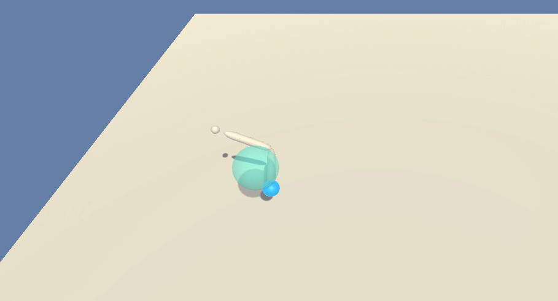
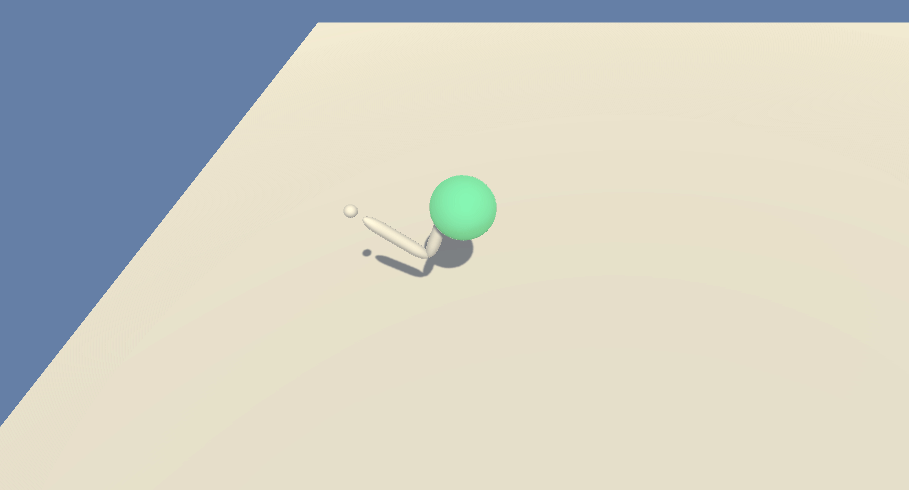
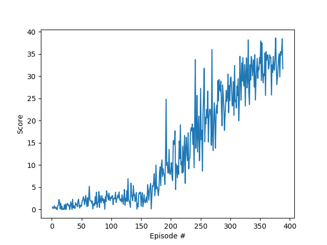

## Project 2 : Continuous Control

Author : Santosh Shukla

This project is implements Deep Deterministic Policy Gradient Network. The deep neural network has following layers:

#### Actor
    1st Fully connected layer - input: 33 (state size) output: 128 (ReLU Activation)
    2nd Fully connected layer - input: 128 output 128 (ReLU Activation)
    3rd Fully connected layer - input: 128 output: 4 (action size) (Tanh Activation)

#### Critic
    1st Fully connected layer - input: 33 (state size) output: 128 (ReLU Activation)
    2nd Fully connected layer - input: 128 + 4 (action_size) output 128 (ReLU Activation)
    3rd Fully connected layer - input: 128 output: 1 (Linear Activation)

Parameters used in DDPG algorithm:

    Learning Rate: 1e-4
    Batch Size: 128
    Tau: 1e-4
    Gamma: 0.99
    Replay Buffer: 1e5
    
The task is episodic, and the environment is considered solved, when the agent gets an average score of +30 over 100 consecutive episodes.

Following is how an untrained agent performs in the Unity Environment

When the agent is trained, following is the behavior 

### Graphs

DDPG algorithm was implemented, the environment is solved in 388 episodes

A longer duration training resulted in the following plot between rewards and number of episodes

### Future work
To try out different algorithms as follows:
- D4PG
- PPO